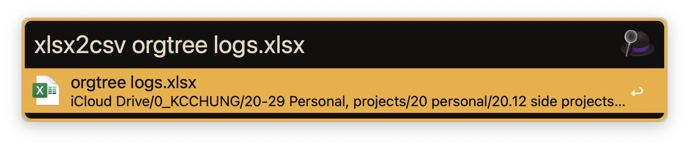
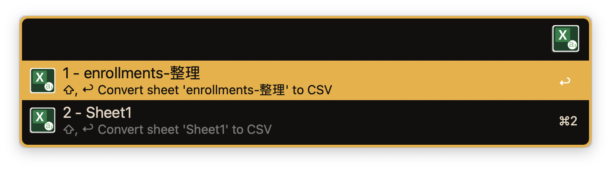
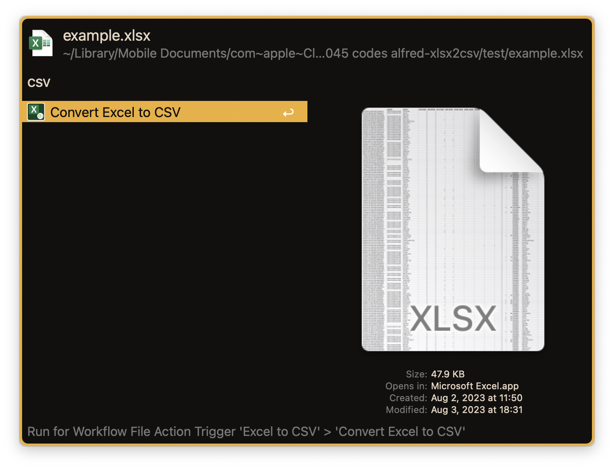

# alfred-xlsx2csv

Convert Excel file to CSV file

## Usage

Search Excel file via `xlsx2csv` keyword

Choose sheet if more than one sheet in Excel file

Search File action via `csv` keyword

## Features

- Convert Excel file to CSV file
  - Convert directly if only one sheet in Excel file
  - Choose sheet if more than one sheet in Excel file
- Alfred
  - File Action
  - File Filter

## Third Party Libraries

- [qax-os/excelize: Go language library for reading and writing Microsoft Excel™ (XLAM / XLSM / XLSX / XLTM / XLTX) spreadsheets](https://github.com/qax-os/excelize)

## Change Log

Vist [CHANGELOG.md](CHANGELOG.md) to check detail information

## License
This project is licensed under the MIT License. See [LICENSE](LICENSE) for details.